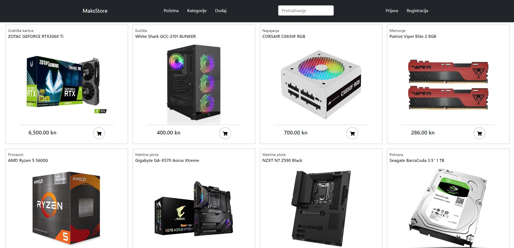

# MaksStore Web Shop
This web application was my final assignment in high school.
It is meant to be a web shop with features of : 
- Previewing products 
- Adding new products
- Searching through products by name or category
- Cart system (add,remove,checkout,etc.)
- Login system
## Technologies used
- HTML
- CSS
- React.Js
- Node.Js
- Express
- OracleMySQL 
- Bootstrap 5
- Heroku hosting
## Preview of the project
https://maksstoreclient.herokuapp.com/

Sometimes it takes longer to load if the website hasn't been opened for some time.

 [ER Diagram](./img/erdiagram.jpg)
 

